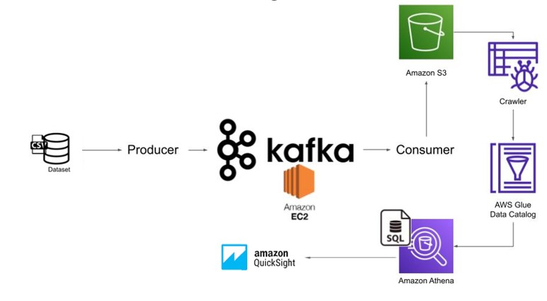

# Project on Data Analysis using Quicksight for Hotel bookings, in Real-Time

## Introduction 
This project explores using AWS cloud, python and Kafka to execute an End-To-End solution for Real-Time Data Analysis for Hotel Bookings.
                                                                  

## Architecture 

## Technology Used
- Programming Language - Python
- Amazon Web Service (AWS)
1. EC2
2. S3 (Simple Storage Service)
3. Glue Crawler/Catalog
4. Athena
6. Quicksight
- Apache Kafka

## Dataset Used
Here is the dataset used in the video - 
https://github.com/KhannaRishika/Hotel_Booking_Analysis_AWS/blob/a96bb8a29477790ee1239337d82a7a51c3364407/Hotel%20Bookings.csv
